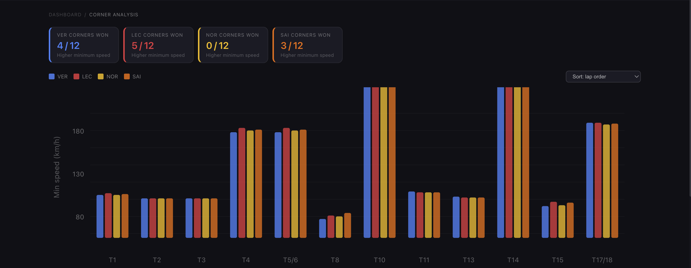
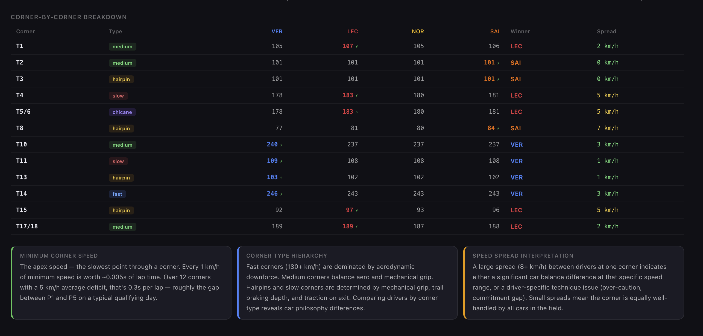
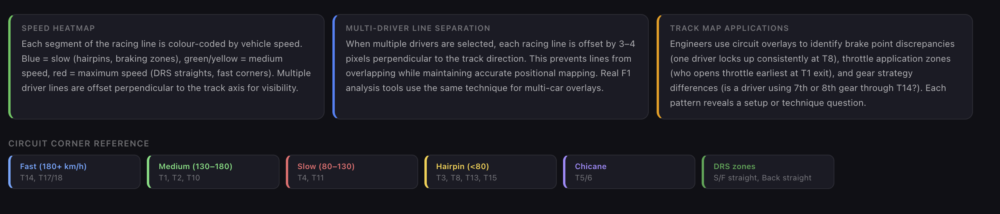
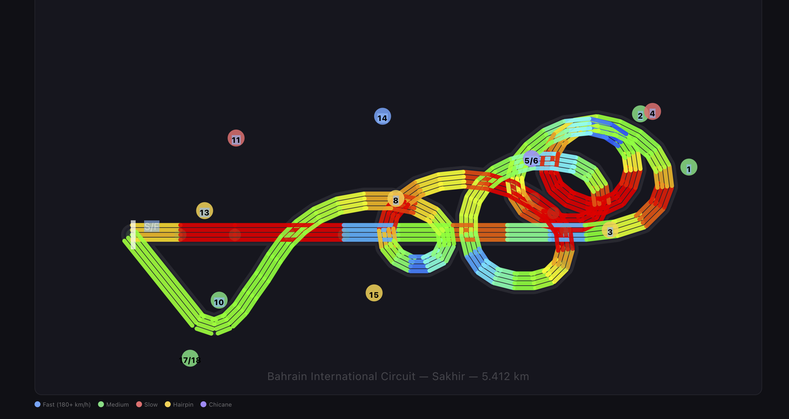
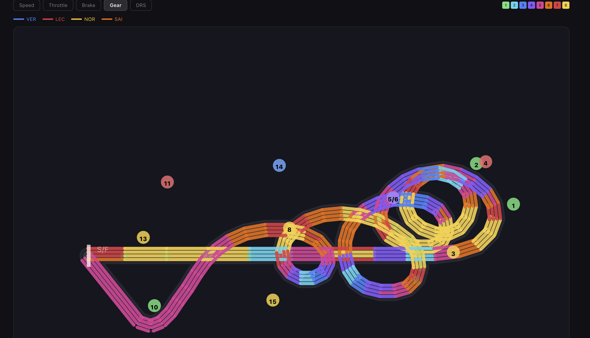
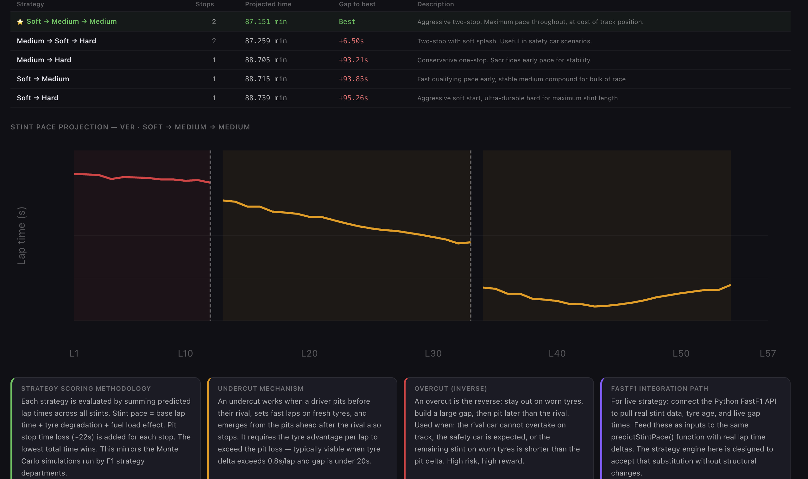
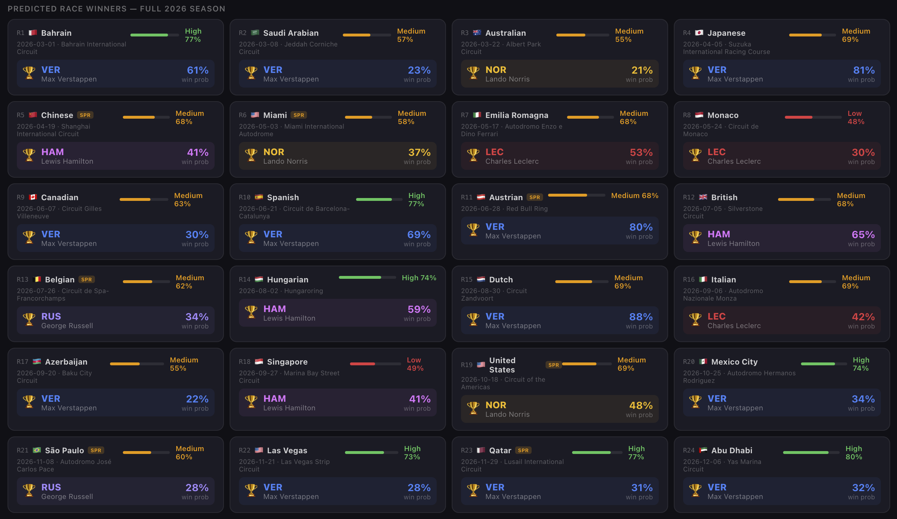

# 🏎️ F1 Pit Wall Platform v2.0

**A production-grade Formula 1 telemetry and race strategy platform for multi-driver lap analysis, tyre modelling, and performance engineering.**

[](https://react.dev)
[](https://vitejs.dev)
[](LICENSE)
[](package.json)

> Compare up to five drivers simultaneously across speed, throttle, brake, RPM, gear, lap delta, tyre degradation, corner performance, and pit strategy windows.  
> Built with custom SVG telemetry visualizations, synchronized hover analysis, deterministic modelling, and FastF1-ready data integration.

---

## 📷 Preview

### Speed Trace


### Corner Analysis


### corner by corner breakdown


### Track Details


### Track-breaking map


### Track gear change map


### Strategy 


### Ai-Insight


### winner prediction


---

## ✨ Key Highlights

- **Multi-driver telemetry comparison** for up to 5 drivers
- **Synchronized hover state** across all visualizations
- **Custom SVG rendering pipeline** with zero charting libraries
- **Deterministic telemetry generation** using seeded modelling
- **Tyre degradation simulation** with compound-specific wear curves
- **Lap delta and corner-level time loss analysis**
- **Strategy recommendation engine** with undercut/overcut scoring
- **FastF1-ready data layer** for real session integration
- **Low bundle overhead** through custom visualization primitives

---

## 🚀 Quick Start

```bash
git clone https://github.com/YOUR_USERNAME/F1_Telemetry_Dashboard_v2.git
cd F1_Telemetry_Dashboard_v2
npm install
npm run dev
```

Local development server:

```text
http://localhost:5173
```

### Production build
```bash
npm run build
```

### GitHub Pages deployment
```bash
npm run deploy
```

---

## 📊 Feature Modules

| Module | Description |
|---|---|
| **Speed Trace** | Multi-driver speed vs distance with DRS zones and qualifying lap references |
| **Throttle & Brake** | Synchronized throttle, brake, RPM, and gear telemetry channels |
| **Lap Delta** | Gap accumulation trace with sector-by-sector time breakdown |
| **Track Map** | SVG Bahrain circuit with telemetry overlay modes |
| **Tyre Model** | Compound wear simulation with fuel-load impact |
| **Corner Analysis** | Apex speed, braking point, and time-loss comparison |
| **Insights Engine** | Model-driven corner recommendations and performance flags |
| **Strategy Engine** | Pit window scoring, stint projection, and undercut modelling |

---

## 🏗️ System Architecture

```text
src/
├── context/
│   └── DashboardContext.jsx
│
├── data/
│   ├── telemetry.js
│   ├── circuit.js
│   ├── analysis.js
│   └── strategy.js
│
├── utils/
│   ├── math.js
│   └── colors.js
│
├── components/
│   ├── LineChart.jsx
│   ├── TrackMap.jsx
│   ├── DriverSelector.jsx
│   ├── Header.jsx
│   ├── UI.jsx
│   └── tabs/
│       ├── SpeedTrace.jsx
│       ├── ThrottleBrake.jsx
│       ├── LapDelta.jsx
│       ├── TrackMapTab.jsx
│       ├── TyreDegradation.jsx
│       ├── CornerAnalysis.jsx
│       ├── CornerInsights.jsx
│       └── Strategy.jsx
│
├── App.jsx
├── main.jsx
└── index.css
```

---

## ⚙️ Engineering Design Decisions

### Shared hover synchronization
Cross-chart telemetry inspection requires every visualization to reference the same track distance.  
This is centralized in **React Context**, eliminating deep prop chains and ensuring stable synchronization across independently rendered tabs.

### Deterministic telemetry modelling
Each driver’s synthetic telemetry profile is generated from a **seeded Linear Congruential Generator (LCG)** keyed to the driver code.  
This guarantees reproducible telemetry traces across renders and simplifies debugging and regression validation.

### Smooth interpolation model
Speed traces are interpolated using **smoothstep transitions** over ~75 driver-specific waypoints.  
This produces physically plausible acceleration and braking curves that resemble real qualifying telemetry.

### Lap-time normalization
Raw telemetry traces are scaled against actual **2024 Bahrain Q3 lap times**, ensuring derived lap delta and corner losses remain grounded in realistic timing distributions.

### Custom SVG rendering
All visualizations are implemented with **hand-authored SVG primitives**, coordinate transforms, and polyline rendering.  
This significantly reduces bundle size compared with external chart libraries while improving control over synchronized telemetry interactions.

---

## ⚡ Performance Considerations

- Minimal visualization overhead using custom SVG primitives
- Shared interaction state avoids duplicate re-renders
- Stable deterministic data generation reduces recomputation
- Small production bundle footprint
- Reusable rendering primitives for future telemetry channels
- Visualization logic decoupled from data ingestion layer

---

## 🔌 Real Telemetry Integration (FastF1)

The data layer is intentionally decoupled from the UI layer.

Swapping synthetic telemetry for real session data requires replacing the driver telemetry builder with FastF1-exported arrays.

### Python extraction
```python
import fastf1
import json

fastf1.Cache.enable_cache('cache/')
session = fastf1.get_session(2024, 'Bahrain', 'Q')
session.load()
```

### React integration
```js
import realData from './real_telemetry.json';
```

All existing tabs and visualizations continue working without UI changes.

---

## 🚢 Deployment

### GitHub Pages
```bash
npm run build
npm run deploy
```

Ensure Vite base path matches the repository:

```js
base: '/F1_Telemetry_Dashboard_v2/'
```

### Vercel
```bash
npx vercel --prod
```

### Netlify
Drag the `dist/` directory into Netlify Drop.

### Docker
```dockerfile
FROM node:18-alpine AS builder
WORKDIR /app
COPY package*.json ./
RUN npm ci
COPY . .
RUN npm run build

FROM nginx:alpine
COPY --from=builder /app/dist /usr/share/nginx/html
EXPOSE 80
```

---

## 🎯 Why This Project

This project explores how modern frontend systems can model workflows typically used in race-engineering and motorsport analytics environments.

The focus areas include:

- deterministic telemetry simulation
- synchronized multi-view analysis
- scalable visualization primitives
- strategy and tyre modelling
- seamless real-data integration pathways

The architecture is intentionally designed so that telemetry sources can evolve from synthetic modelling to real session ingestion with minimal surface-area changes.

---

## 📈 Roadmap

### Data & Simulation
- [ ] Live FastF1 session ingestion
- [ ] Race stint modelling
- [ ] Weather and ERS telemetry channels
- [ ] G-force channels
- [ ] Multi-circuit support

### Intelligence & Optimization
- [ ] Driver style clustering
- [ ] Tyre stint boundary detection
- [ ] Pit stop optimization under traffic
- [ ] Season-wide performance heatmaps
- [ ] Strategy risk scoring

---

## 📄 License

MIT License — see [LICENSE](LICENSE)

---

<div align="center">

**Built for motorsport analytics, telemetry engineering, and advanced frontend systems design.**

</div>
